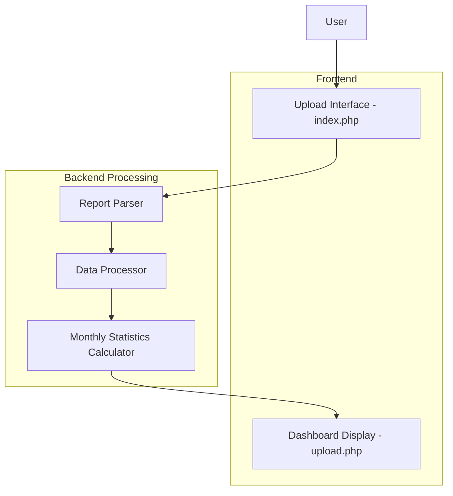

# Monthly Analysis Dashboard Design

**Document Status:** Draft
**Last Updated:** Today
**Author:** Qoder AI Assistant

## 1. Overview

This document outlines the design for a monthly analysis dashboard that will display key performance metrics from MT5 backtest reports. The dashboard will aggregate trade data by month and year, presenting essential metrics for performance evaluation.

Based on the existing system which consists of:
- An upload interface (index.php) for submitting MT5 backtest reports
- A processing script (upload.php) that parses reports and displays results

The monthly analysis dashboard will enhance the existing functionality by organizing and presenting trading performance metrics in a tabular format with the following columns:
- Bulan Tahun (Month Year)
- Profit Trade
- Loss Trade 
- Jumlah Trade (Number of Trades)
- Winrate
- Gross Profit
- Gross Loss
- Net Profit
- Profit Factor
- Recovery Factor
- Max Drawdown
- Expected Payoff
- Sharpe Ratio

## 2. Architecture

The existing application architecture will be enhanced to include the monthly analysis dashboard:



The system follows a three-tier architecture:
1. **Presentation Layer**: HTML interface for uploading reports and displaying results
2. **Business Logic Layer**: PHP scripts for parsing, processing, and calculating statistics
3. **Data Layer**: HTML report files containing raw trading data

## 3. Data Model

### 3.1 Trade Data Structure
The system processes individual trades with the following attributes:
- Time (timestamp)
- Profit/Loss (decimal value)
- Order details
- Symbol information

### 3.2 Monthly Statistics Structure
The dashboard will display aggregated monthly data with exactly these metrics as requested:

| Field | Description | Calculation |
|-------|-------------|-------------|
| Field | Description | Calculation |
|-------|-------------|-------------|
| Bulan Tahun | Month and Year | Extracted from trade timestamp |
| Profit Trade | Total profit from winning trades | Sum of positive trade profits |
| Loss Trade | Total loss from losing trades | Sum of negative trade profits |
| Jumlah Trade | Total number of trades | Count of all trades |
| Winrate | Percentage of winning trades | (Winning trades / Total trades) × 100 |
| Gross Profit | Total profit from winning trades | Same as Profit Trade |
| Gross Loss | Total loss from losing trades | Same as Loss Trade |
| Net Profit | Overall profit/loss | Profit Trade + Loss Trade |
| Profit Factor | Profitability efficiency | Gross Profit / |Gross Loss| |
| Recovery Factor | Risk-adjusted return | Net Profit / Max Drawdown |
| Max Drawdown | Largest peak-to-trough decline | Calculated from equity curve |
| Expected Payoff | Average profit per trade | Net Profit / Jumlah Trade |
| Sharpe Ratio | Risk-adjusted return | (Return - Risk-free rate) / Standard deviation |

## 4. Component Design

### 4.1 Data Processing Components

#### Trade Extractor
Responsible for parsing HTML reports and extracting individual trade data:
- Locates trades table in HTML document
- Extracts trade details (time, profit/loss, etc.)
- Returns array of trade objects

#### Monthly Aggregator
Processes individual trades into monthly statistics:
- Groups trades by year-month combination
- Calculates all required metrics for the dashboard

#### Metrics Calculator
Computes advanced performance metrics:
- Recovery Factor
- Max Drawdown (requires equity curve tracking)
- Sharpe Ratio
- Expected Payoff

### 4.2 Display Components

#### Dashboard View
Presents monthly statistics in tabular format exactly as requested:
- Columns for all required metrics (Bulan Tahun, Profit Trade, Loss Trade, etc.)
- Sortable columns by any metric
- Formatted numerical values with proper decimal places
- Responsive design for different screen sizes

## 5. Data Flow

The existing application follows this data flow:
1. User uploads HTML backtest report through index.php
2. upload.php processes the file and extracts trade data
3. Trades are grouped by month-year
4. All required metrics are calculated for each month
5. Results are displayed in the requested tabular format

No additional API endpoints are needed as the functionality will be integrated into the existing upload.php processing flow.

## 6. Business Logic

### 6.1 Data Aggregation Process

``mermaid
flowchart TD
    A[Parse HTML Report] --> B[Extract Trade Data]
    B --> C[Group Trades by Month-Year]
    C --> D[Calculate Required Metrics]
    D --> E[Format Dashboard Data]
    E --> F[Display Monthly Analysis]
```

1. Parse HTML report to extract individual trade data
2. Group trades by month-year combination
3. For each month-year group, calculate all required metrics:
   - Profit Trade (sum of positive profits)
   - Loss Trade (sum of negative profits)
   - Jumlah Trade (count of all trades)
   - Winrate = (Winning trades / Total trades) × 100
   - Gross Profit (same as Profit Trade)
   - Gross Loss (same as Loss Trade)
   - Net Profit = Profit Trade + Loss Trade
   - Profit Factor = Gross Profit / |Gross Loss|
   - Recovery Factor = Net Profit / Max Drawdown
   - Max Drawdown = Largest peak-to-trough decline in equity
   - Expected Payoff = Net Profit / Jumlah Trade
   - Sharpe Ratio = (Average return - Risk-free rate) / Standard deviation
4. Format data for dashboard display with proper numerical formatting

### 6.2 Metrics Calculation Details

#### Profit Factor
Measures the profitability efficiency of a trading strategy:
```
Profit Factor = Gross Profit / |Gross Loss|
```
Where Gross Profit is the sum of all profitable trades and Gross Loss is the sum of all losing trades (absolute value).

#### Winrate
Percentage of winning trades:
```
Winrate = (Number of Winning Trades / Total Trades) × 100
```

#### Recovery Factor
Risk-adjusted return measure:
```
Recovery Factor = Net Profit / Max Drawdown
```

#### Max Drawdown
Largest peak-to-trough decline in equity:
This requires tracking the equity curve over time and calculating the largest percentage drop from a peak to a trough.

#### Expected Payoff
Average profit/loss per trade:
```
Expected Payoff = Net Profit / Total Number of Trades
```

#### Sharpe Ratio
Risk-adjusted return measure:
```
Sharpe Ratio = (Average Return - Risk-free Rate) / Standard Deviation of Returns
```
For this implementation, we can approximate with a risk-free rate of 0 and calculate the standard deviation of monthly returns.

## 7. UI/UX Design

### 7.1 Dashboard Layout

The dashboard will be integrated into the existing results display in upload.php:

#### Header Section
- Title: "Hasil Analisis Laporan Backtest"
- Report information (symbol, period, model)

#### Monthly Data Table
Main table displaying all requested metrics exactly as specified:

| Bulan Tahun | Profit Trade | Loss Trade | Jumlah Trade | Winrate | Gross Profit | Gross Loss | Net Profit | Profit Factor | Recovery Factor | Max Drawdown | Expected Payoff | Sharpe Ratio |
|-------------|--------------|------------|--------------|---------|--------------|------------|------------|---------------|-----------------|--------------|-----------------|--------------|
| 05/2023     | 1,250.00     | -750.00    | 42           | 64.29%  | 1,250.00     | -750.00    | 500.00     | 1.67          | 2.5             | 300.00       | 11.90           | 1.25         |
| 06/2023     | 2,100.00     | -950.00    | 56           | 60.71%  | 2,100.00     | -950.00    | 1,150.00   | 2.21          | 3.2             | 420.00       | 20.54           | 1.42         |

The table will be sortable by clicking on column headers, and numerical values will be properly formatted with thousands separators and appropriate decimal places.

#### Performance Charts
- Net Profit trend over time
- Winrate comparison across months
- Drawdown visualization

## 8. Implementation Plan

### 8.1 Backend Enhancements
1. Extend `calculateMonthlyStats()` function in upload.php to include all required metrics
2. Implement Max Drawdown calculation algorithm
3. Implement Sharpe Ratio calculation
4. Implement Recovery Factor calculation
5. Add data export functionality (CSV, JSON)

### 8.2 Frontend Enhancements
1. Modify the results display in upload.php to show the monthly analysis table
2. Implement proper formatting for all numerical values
3. Add sorting capabilities to table columns
4. Add filtering controls by year
5. Improve styling and visual design of the dashboard

### 8.3 Data Validation
1. Validate trade data integrity
2. Handle missing or malformed data
3. Ensure proper date parsing
4. Validate metric calculations

## 9. Testing Strategy

### 9.1 Unit Tests
- Trade parsing functionality from HTML reports
- Monthly aggregation logic for all required metrics
- Accuracy of each metric calculation
- Edge case handling (empty data, missing values, malformed reports)

### 9.2 Integration Tests
- End-to-end report processing and display
- Verification of all requested metrics in the dashboard
- Data formatting and display accuracy

### 9.3 Validation Tests
- Comparison of calculated metrics with known values
- Verification of mathematical formulas implementation

## 10. Security Considerations

- File upload validation (restricting to .htm/.html files only)
- HTML content sanitization
- Input validation for all parameters
- Protection against malicious file uploads
- Proper error handling to prevent information disclosure