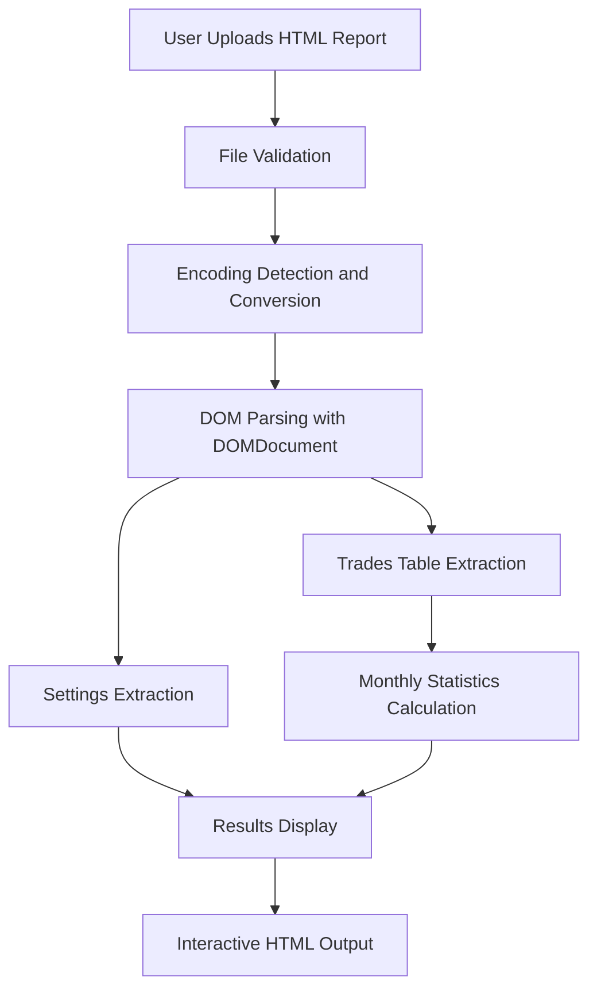

# New Monthly Report Validation Design

## Overview
This document outlines the design for validating and fixing issues with new monthly report functionality in the backtest analysis application. The issue reported is that a new monthly report file (`ReportTester-5036666090.html`) is not displaying properly when processed through the application.

## Architecture
The application follows a simple three-tier architecture:
1. **Presentation Layer**: HTML form interface (index.php) for file upload
2. **Business Logic Layer**: PHP processing scripts (upload.php, test_upload.php) for parsing and analyzing reports
3. **Data Layer**: HTML report files containing trading data from MetaTrader 5

### Data Flow


## Report Validation Process
To address the issue with the new monthly report not displaying, we need to implement a comprehensive validation process:

### 1. File Integrity Validation
- Verify the file is not corrupted
- Check file size is within expected range
- Confirm file is readable

### 2. Encoding Validation
- Detect UTF-16 byte order marks
- Validate UTF-8 conversion success
- Check for encoding artifacts

### 3. HTML Structure Validation
- Verify HTML document structure
- Check for presence of required elements
- Validate table structures

### 4. Content Validation
- Ensure presence of key fields (Time, Profit)
- Validate date formats
- Check for sufficient data to calculate statistics

## Technical Implementation

### Enhanced Error Handling
```php
// Add before processing
if (!file_exists($target_file) || filesize($target_file) == 0) {
    throw new Exception("File is missing or empty");
}

// Add encoding validation
if (!mb_check_encoding($html, 'UTF-8')) {
    throw new Exception("File encoding is invalid");
}

// Add DOM validation
libxml_use_internal_errors(true);
$doc = new DOMDocument();
$loaded = $doc->loadHTML($html);
if (!$loaded) {
    $errors = libxml_get_errors();
    throw new Exception("Failed to parse HTML: " . implode(", ", array_map(function($error) {
        return $error->message;
    }, $errors)));
}
```

### Report Structure Validation
```php
function validateReportStructure($doc) {
    // Check for required elements
    $tables = $doc->getElementsByTagName('table');
    if ($tables->length == 0) {
        throw new Exception("No tables found in report");
    }
    
    // Look for trades table specifically
    $tradesTable = findTradesTable($tables);
    if (!$tradesTable) {
        throw new Exception("Could not locate trades table in report");
    }
    
    // Validate table structure
    $headerRow = $tradesTable->getElementsByTagName('tr')->item(0);
    if (!$headerRow) {
        throw new Exception("Trades table has no header row");
    }
    
    // Check for required columns
    $headers = [];
    foreach ($headerRow->getElementsByTagName('td') as $th) {
        $headers[] = trim($th->textContent);
    }
    
    if (!in_array('Time', $headers) || !in_array('Profit', $headers)) {
        throw new Exception("Required columns (Time, Profit) not found in trades table");
    }
    
    return true;
}
```

### Enhanced Debugging Output
```php
function debugReportAnalysis($target_file) {
    echo "<h3>Report Analysis Debug Info</h3>";
    echo "<p>File: " . htmlspecialchars($target_file) . "</p>";
    echo "<p>File size: " . filesize($target_file) . " bytes</p>";
    
    // Check file readability
    $html = file_get_contents($target_file);
    if ($html === false) {
        echo "<p style='color:red'>ERROR: Cannot read file</p>";
        return;
    }
    
    echo "<p>File read successfully</p>";
    
    // Check encoding
    $isUTF16 = (substr($html, 0, 2) === "\xFF\xFE" || substr($html, 0, 2) === "\xFE\xFF");
    echo "<p>UTF-16 detected: " . ($isUTF16 ? "Yes" : "No") . "</p>";
    
    if ($isUTF16) {
        $converted = iconv("UTF-16", "UTF-8//IGNORE", $html);
        if ($converted === false) {
            echo "<p style='color:red'>ERROR: Failed to convert UTF-16 to UTF-8</p>";
            return;
        }
        $html = $converted;
        echo "<p>UTF-16 to UTF-8 conversion successful</p>";
    }
    
    // Parse with DOM
    libxml_use_internal_errors(true);
    $doc = new DOMDocument();
    $loaded = @$doc->loadHTML($html);
    
    if (!$loaded) {
        echo "<p style='color:red'>ERROR: Failed to parse HTML</p>";
        $errors = libxml_get_errors();
        foreach ($errors as $error) {
            echo "<p>Error: " . htmlspecialchars($error->message) . "</p>";
        }
        return;
    }
    
    echo "<p>HTML parsed successfully</p>";
    
    // Analyze tables
    $tables = $doc->getElementsByTagName('table');
    echo "<p>Tables found: " . $tables->length . "</p>";
    
    foreach ($tables as $i => $table) {
        $textContent = $table->textContent;
        echo "<p>Table $i: " . strlen($textContent) . " characters</p>";
        echo "<pre>" . htmlspecialchars(substr($textContent, 0, 200)) . "...</pre>";
    }
}
```

## Validation Test Cases

### Test Case 1: Valid Report Processing
- Input: Standard MT5 HTML report with trades
- Expected: Properly parsed and displayed monthly statistics
- Validation: All metrics calculated and displayed correctly

### Test Case 2: Empty or Corrupted File
- Input: Empty or corrupted HTML file
- Expected: Clear error message displayed to user
- Validation: Appropriate error handling without application crash

### Test Case 3: Missing Required Data
- Input: HTML file without Time or Profit columns
- Expected: Informative error message about missing data
- Validation: Graceful handling with specific error information

### Test Case 4: Encoding Issues
- Input: UTF-16 encoded file with conversion problems
- Expected: Successful conversion and processing
- Validation: Proper encoding detection and conversion

### Test Case 5: New Report Format
- Input: Report with different table structure or column order
- Expected: Successful parsing using flexible matching
- Validation: Adaptability to format variations

## Data Models

### Monthly Statistics Structure
```php
$monthlyData[$key] = [
    'bulan' => $month,
    'tahun' => $year,
    'profit_trade' => 0,
    'loss_trade' => 0,
    'jumlah_trade' => 0,
    'winrate' => 0,
    'gross_profit' => 0,
    'gross_loss' => 0,
    'net_profit' => 0,
    'profit_factor' => 0,
    'recovery_factor' => 0,
    'max_drawdown' => 0,
    'expected_payoff' => 0,
    'sharpe_ratio' => 0,
    'winning_trades' => 0,
    'losing_trades' => 0,
    'total_winning' => 0,
    'total_losing' => 0,
    'equity_curve' => [],
    'profits' => []
];
```

## Business Logic Validation

### Report Parsing Validation
1. Verify file upload success
2. Confirm file type is HTML/HTM
3. Validate file accessibility
4. Check HTML parsing success
5. Ensure required tables exist
6. Validate column headers

### Data Processing Validation
1. Check for minimum required data
2. Validate date format parsing
3. Confirm numeric value parsing
4. Verify calculation inputs
5. Validate statistical calculations

### Output Validation
1. Confirm data formatting
2. Check display structure
3. Validate sorting functionality
4. Ensure error messages are user-friendly

## Error Handling Improvements

### Detailed Error Reporting
- Specific error messages for different failure points
- Logging of parsing errors for debugging
- User-friendly error display
- Graceful degradation when partial data is available

### Recovery Mechanisms
- Fallback parsing for malformed HTML
- Partial data extraction when possible
- Alternative calculation methods
- Default values for missing data

## Testing Strategy

### Unit Tests
1. File validation functions
2. Encoding conversion functions
3. HTML parsing functions
4. Statistical calculation functions

### Integration Tests
1. Complete report processing workflow
2. Error handling scenarios
3. Different report formats
4. Edge case handling

### User Acceptance Tests
1. Successful report upload and processing
2. Error message clarity
3. Display functionality
4. Sorting capabilities

## Implementation Plan

### Phase 1: Diagnostic Enhancement
- Add detailed logging to parsing process
- Implement enhanced error reporting
- Create debug output for troubleshooting

### Phase 2: Validation Implementation
- Add file integrity checks
- Implement encoding validation
- Add HTML structure validation

### Phase 3: Error Handling Improvements
- Enhance error messages
- Add graceful degradation
- Implement fallback mechanisms

### Phase 4: Testing and Validation
- Execute test cases
- Validate with problem report
- Performance testing